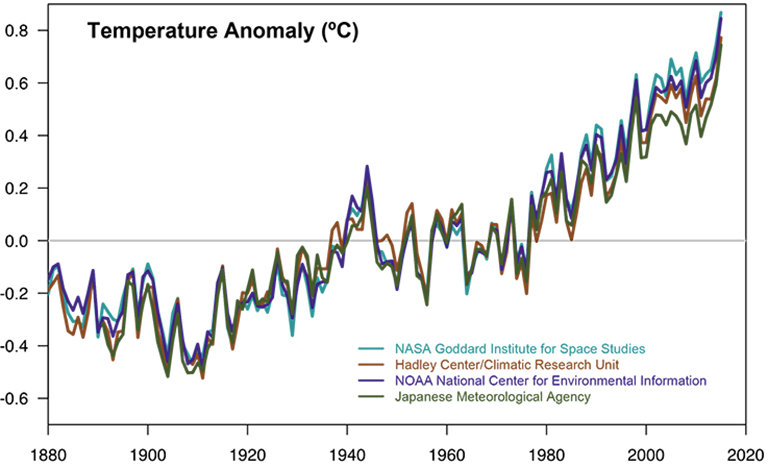
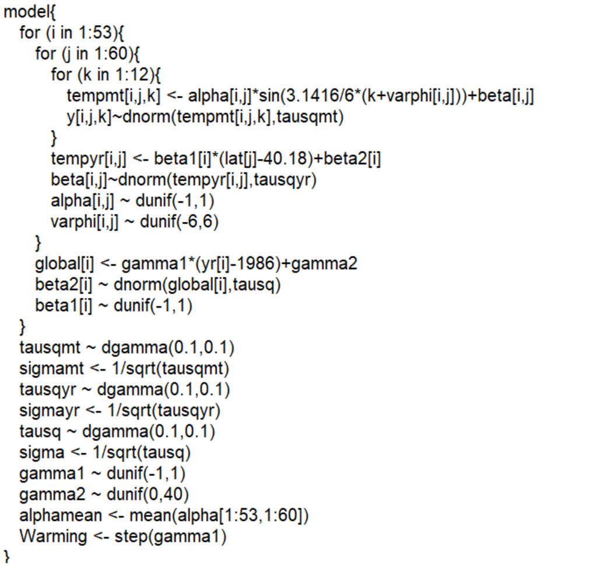
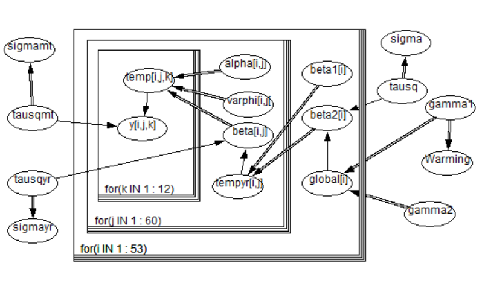

# 摘要

20世纪以来工业活动的加剧使全球变暖逐渐进入人们的视野，步入21世纪联合国正式将气候变暖列为人类面临的最大挑战之一。

但是对于全球温度的升高，我们的感受似乎并不明显，有人对此提出质疑的声音，甚至有科学家提出相反的证据说明地球正在步入下一个冰河世纪。


NASA数据显示，19世纪以来全球地表温度已经升高了1.62华氏度（约0.9摄氏度）。\cite{1}

另外，据IPCC的统计，70年代以来陆地温度的上升率达到海洋的两倍，为每十年0.25摄氏度。\cite{2}



那么数据是否支持这些结论呢？下面我们将利用贝叶斯统计方法（主要为MCMC蒙特卡洛马可夫链）进行分析。


# 数据与模型

## 数据介绍

1.数据来源：

Berkeley Earth
Berkeley Earth是伯克利劳伦斯国家实验室下设的一个分支。他们关于地表温度的研究总结了之前16篇文章的16亿份温度报告。

2.关于数据包

数据可在Berkeley Earth 官方网站(http://berkeleyearth.org/data/)
或者其在Kaggle上的thread找到(https://www.kaggle.com/berkeleyearth/climate-change-earth-surface-temperature-data )。\cite{3}

基于我们的分析目的，我们的样本只限于主要城市的温度数据(GlobalLandTemperaturesByMajorCity.csv)。另外在将数据导入R之前，我们先删去一些冗余数据列(所属国家，经度，数据误差)以压缩文件大小，并将由此得到的csv文件作为我们的原始数据。

3.数据的预处理
```{r}
data <- read.csv('GlobalLandTemperaturesByMajorCity.csv')
summary(data)
```
首先为了消除南北半球季节周期相反造成的温度变化差异对我们模型的影响，我们只取出所有北半球北纬20度以北的数据。
```{r}
NorthHalf <- subset(data,grepl('N',data$Latitude))

```

筛选出北半球后，我们需要把纬度从字符转成数字。
```{r}
ConvertLatitude <- function(La){
  return(as.numeric(substring(La,1,nchar(La)-1)))
}
LatitudeModified <-  apply(as.data.frame(NorthHalf$Latitude),2,ConvertLatitude)
NorthHalf = subset(NorthHalf,select = -Latitude)
NorthHalf$Latitude <- as.vector(LatitudeModified)
NorthHalf <- subset(NorthHalf,Latitude>=20)
dim(NorthHalf)[1]/dim(data)[1]
```
因为全球大半主要城市在北半球，所以我们保留了约64%的样本。

另外，该数据由于年代较早而缺失的数据是使用数学方法重建的，为了避免误差同时进一步压缩数据我们只选取1960年1月1日（含）之后的记录。
```{r}
NorthHalfRecent <- subset(NorthHalf,as.numeric(substring(dt,1,4)) >= 1960)
```

我们把年份和月份分离作为单独的变量。
```{r}

Convertdt2yr <- function(x){
  return(as.numeric(substring(x,1,4)))
}
yr <- Convertdt2yr(NorthHalfRecent$dt)
NorthHalfRecent$year <- as.vector(yr)
datevector <- as.vector(NorthHalfRecent$dt)
dateconverted <- 1:length(datevector)
for (x in 1: length(datevector)){
    if (nchar(datevector[x])  == 8){
        dateconverted[x] = as.numeric(substring(datevector[x],6,6))
    }
    else{
        dateconverted[x] = as.numeric(substring(datevector[x],6,7))
  }
}
NorthHalfRecent$month <- dateconverted 
NorthHalfRecent <- subset(NorthHalfRecent,select = -dt)
```
另外我们可以留出最后一年的数据作为测试指标。

```{r}
NorthHalf2012 <- subset(NorthHalfRecent,year == 2012)
NorthHalfRecent <- subset(NorthHalfRecent,year < 2013 & 
                            year > 1959)
length(unique(NorthHalfRecent$City))-length(unique(NorthHalfRecent$Latitude))
```

这里可以发现，并非每一个独立城市的纬度都是唯一的，存在大量纬度重合的情况，这对于后续分析会起到不利干扰，因此我们添加一个小扰动。
```{r}
for (i in unique(NorthHalfRecent$City)){
  NorthHalfRecent$Latitude[NorthHalfRecent$City == i] = jitter(NorthHalfRecent$Latitude[NorthHalfRecent$City == i][1])
}
length(unique(NorthHalfRecent$City))-length(unique(NorthHalfRecent$Latitude))
```

这样保证了每个城市与纬度的一一对应。


检验脏数据
```{r}
NAs <- subset(NorthHalfRecent,is.na(NorthHalfRecent$AverageTemperature))
dim(NAs)[1]
```

总结：最终我们得到了包含五个变量的数据集：一个定类变量（城市名称）和四个定序变量（年份，月份，城市纬度，和平均温度）


## 模型介绍

在正式建立模型之前，我们的模型基于三个假设：

1.特定的样本个体（城市）在某一特定年份中月平均气温(tempmt)与月份(mt)成正弦相关，且回归关系为：
$$\begin{aligned}
tempmt = \alpha \sin\left(\frac{π(mt+\varphi)}{6}\right)+\beta\\
y\sim Normal(tempmt,\sigma^2)
\end{aligned}$$

2.样本个体（城市）在某一特定年份中的年平均气温(tempyr)与城市纬度(lat)线性负相关

$$\begin{aligned}
tempyr &=  \beta_1 (lat-\mu)+\beta_2\\
\mu &= \frac{lat_{max}+lat_{min}}{2}
\end{aligned}$$

3.样本个体（城市）从1960年开始每一年份的年平均气温(temp)与年份(yr)线性正相关

$$\begin{aligned}
temp &= \gamma_1 (yr-\mu)+\gamma_2\\
\mu &= \frac{yr_{max}+yr_{min}}{2}
\end{aligned}$$

在阐述模型之前，我们首先检验假设的合理性。

验证假设一：

特定的样本个体（城市）在某一特定年份中月平均气温(tempmt)与月份(mt)成正弦相关，且回归关系为：
$$\begin{aligned}
tempmt = αsin\left(\frac{(mt+\varphi)\pi}{6}\right)+\beta\\
y\sim Normal(tempmt,σ^2)\\
\end{aligned}$$


首先在所有城市中抽取总量为9的样本，再为这些城市随机选取一个年份，然后我们对随机取出的这一年中九个城市的温度数据进行上述模型匹配，将得到的结果显示在图像上。

```{r}
#抽样
sample9city<-sample(unique(NorthHalfRecent$City),9,replace = FALSE);
sample9citydata <-  subset(NorthHalfRecent,is.element(NorthHalfRecent$City,sample9city))
sample9city1yr <- subset(sample9citydata,sample9citydata$year == sample(unique(sample9citydata$year),1)) 

```


这里因为存在相位参数的原因我们使用公式进行转换：
$$\begin{aligned}
a \sin(x) + b \cos(x) +\beta &= \sqrt{a^2+b^2} \left(\frac{a}{\sqrt{a^2+b^2}} \sin(x) + \frac{b}{\sqrt{a^2+b^2}} \cos(x)\right)+\beta\\
 &= \alpha\left[\sin(x)\cos(\varphi) + \cos(x)\sin(\varphi)\right]+beta\\
 &= \alpha\sin(x+\varphi)+\beta
\end{aligned}$$
其中变量转化公式为：
$$\begin{aligned}
\sin\varphi = \frac{b}{\sqrt{a^2+b^2}}\\
\alpha=\sqrt{a^2+b^2}
\end{aligned}$$

```{r}
#画图
PlotTemp2Mt <- function(cities,city){
  city1 <- subset(cities,cities$City == city)
  plot(city1$AverageTemperature~city1$month,xlab = 'month',ylab = 'temperature')
  title(paste(city,as.character(city1$year[1])))
  fit = lm(city1$AverageTemperature~cos(pi/6*city1$month)+sin(pi/6*city1$month))
  lines(city1$month,fitted(fit),col = 'red',lwd = 2)
}
par(mfrow = c(3,3))
for (i in sample9city){
  PlotTemp2Mt(sample9city1yr,i)
}
```

这里使用正弦函数有两个好处，第一是可以准确捕捉数据的周期性，第二可以引入冗余参数(相位，即最高气温对应的月份值)而不影响我们关心的主要参数(气温波动幅度和平均气温)的计算。


验证假设二：


样本个体（城市）在某一特定年份中的年平均气温(tempyr)与城市纬度(lat)线性负相关

$$\begin{aligned}
tempyr =  \beta_1 (lat-\mu)+\beta_2\\
\mu = \frac{lat_{max}-lat_{min}}{2}
\end{aligned}$$
我们取出九个随机年份,为每个年份中每个城市计算年平均气温，最后将年平均气温作为因变量，纬度作为自变量，对数据进行拟合。
```{r}
#WTF
options(warn = -1)
years9 <- sample(unique(NorthHalfRecent$year),9,replace = FALSE)
sample9yr <- subset(NorthHalfRecent,is.element(NorthHalfRecent$year,years9))
suppressWarnings(library(dplyr))
PlotTemp2Lat <- function(years,yr){
  year1 <- subset(years,years$year == yr)
  grp <- group_by(year1,City)
  grped <- summarize(grp,mean = mean(AverageTemperature))
  merged <- merge(year1,grped,by = 'City')
  plot(merged$Latitude,merged$mean,xlab ='latitude',ylab = 'temperature')
  title(paste('Temperature',as.character(yr)))
  fit = lm(merged$mean~merged$Latitude)
  lines(merged$Latitude,fitted(fit),col = 'red',lwd = 2)
}
par(mfrow = c(3,3))
for (i in years9){
  PlotTemp2Lat(sample9yr,i)
}
```


可见虽然存在个别outlier的干扰，但是总体上看符合预期。


验证假设三：
3.样本个体（城市）从1960年开始每一年份的年平均气温(temp)与年份(yr)线性正相关

$$\begin{aligned}
temp &= \gamma_1 (yr-\mu)+\gamma_2\\
\mu &= \frac{yr_{max}+yr_{min}}{2}
\end{aligned}$$

这里我们直接将各年的温度数度取均值后对年份进行拟合，温度变化大致趋势如下：
```{r}
grp <- group_by(NorthHalfRecent,year)
grped<- summarize(grp,mean = mean(AverageTemperature))
merged <- merge(NorthHalfRecent,grped,by = 'year')
merged <- subset(merged,select = c(year,mean)) 
merged = distinct(merged)
plot(merged$year,merged$mean,xlab = 'year',ylab = 'temperature')
title('Global temperature from 1960')
fit = lm(merged$mean~merged$year)
lines(merged$year,fitted(fit),col = 'red',lwd = 2)
```
虽然个体方差比较大，但是仍然可以清晰地看出正相关关系。

在验证了所有假设后，我们提出基于上述三个假设的三层梯度模型：
首先将数据分为三层，第一层为年份，序列下标为i，第二层为纬度，序列下标为j，第三层为月份，序列下标为k。
由上述分类方法，我们可以知道
$$y[i,j,k]$$
代表第i年，纬度为j的城市，在第k月的平均温度.


例如卡萨布兰卡(Casablanca,纬度为32.95N)在1999年7月的平均气温可以表示为：

$$y[1999,32.95,7] = 26.261$$

由于不可能存在两个城市的纬度重合，所以我们的分层结果完全覆盖原数据且与原数据行一一对应。


根据上述的分层方法，我们的模型可以表述如下：

首先，我们的假设一说的是对于某一年份某个城市的12个月份而言：
$$\begin{aligned}
tempmt[i,j,k] &= \alpha[i,j] \sin\left(\frac{\pi(k+\varphi)}{6}\right)+\beta[i,j]\\
y[i,j,k]&\sim Normal(temp[i,j,k],\sigma_{mt}^2)
\end{aligned}$$

这里我们关心的参数有三个：alpha衡量四季温度波动幅度，beta衡量月平均气温的均值,sigmamt衡量月平均气温对回归曲线的偏离程度(为了简化计算，我们假设每一年每一城市的sigmamt不变，这一假设也比较符合事实)。varphi角作为nuisance parameter衡量温度峰值出现的月份，出于我们的分析目的不纳入考虑。

我们的假设二说明了纬度不同的城市在某一年的年平均气温(容易证明年平均气温为月平均气温的均值)与纬度的关系。这里年平均气温可以用我们刚刚提出的参数beta(这也是使用正弦回归的一个便利之处：可以直接利用参数的意义)来表示。
$$\begin{aligned}
tempyr[i,j] &=  \beta_1[i] (j-\mu)+\beta_2[i]\\
\mu &= \frac{lat_{max}+lat_{min}}{2}\\
\beta[i,j]&\sim Normal(tempyr[i,j],\sigma_{yr}^2) \\
\end{aligned}$$

这里beta1代表某一年所有城市年平均温度与城市纬度的相关度，beta2代表这一年所有城市年平均温度的平均值(注意beta2，beta与y之间属于层层递进的关系)，lat[i,j]来自数据代表城市j的纬度，sigmayr代表beta对回归曲线的偏离程度(同样，我们假设所有年份偏离程度相同，对于时间跨度不太大的数据是合理的) mu是常数可以直接计算得出。


最后，根据假设三，我们终于可以开始分析全球变暖的总趋势。假设三说明了所有城市在某一年的气温与年份正相关(全球变暖现象的回归表述)。这里所有城市的年均气温的均值可以用上述beta2来替代。

$$\begin{aligned}
temp[i] &= \gamma_1 (i-\mu)+\gamma_2\\
\mu &= \frac{yr_{max}+yr_{min}}{2}\\
beta2[i] &\sim Normal(temp[i],\sigma^2) 
\end{aligned}$$

这里gamma1代表全球变暖的幅度，gamma2代表时间跨度内全球的平均温度，mu同样是容易计算的常数，sigma衡量全球平均温度对回归曲线的偏离程度。


到这里我们基本完成了模型的阐述，为了贝叶斯分析的需要我们还需要对参数给定先验函数，由于我们不具有任何专业知识，我们决定采用无信息先验。

# 统计分析

## 描述分析


```{r}
summary(subset(NorthHalfRecent,select = -City))
```

部分的描述分析我们在上面建模时已经给出，这里不再赘述。下面我们就个体的原始数据抽样进行回归分析，可见几乎所有的城市在每个月份温度年份变化趋势都是正值,年均温度上升在0.001-0.1度之间。

```{r}
mtname <- c('Jan','Feb','Mar','Apr','May','Jun','Jul','Aug','Sep','Oct','Nov','Dec')
PlotTempbymt = function(temps,city,mt){
  tempbymt <- subset(temps,temps$month == mt & temps$City == city)
  plot(tempbymt$year,tempbymt$AverageTemperature,xlab='year',ylab = 'Temperature')
  fit = lm(tempbymt$AverageTemperature~tempbymt$year)
  title(paste('Temperature of',city,'in',mtname[mt],'\n','rate = ', round(fit$coefficients[2],4)))
  lines(tempbymt$year,fitted(fit),col ='blue',lwd = 2 )
}
par(mfrow = c(2,2))
for (i in sample(seq(1,12,by=1),4,replace = FALSE)){
  j = sample(NorthHalfRecent$City,1)
  PlotTempbymt(NorthHalfRecent,j,i);
}
```

这是前面给出的全球年平均温度的变化率，大约是+0.021度/年。

```{r}
plot(merged$year,merged$mean,xlab = 'year',ylab = 'temperature')
title('Global temperature from 1960')
fit = lm(merged$mean~merged$year)
lines(merged$year,fitted(fit),col = 'red',lwd = 2)
fit$coefficients[2]
```


## 回归分析

我们选择在openbugs中进行MCMC分析。为了把数据传入openbugs我们首先需要进行一些格式上的变化，比如将温度数据转化为空间维度为3的多维数组。实现方法如下：
```{r}
NorthHalfRecent <- NorthHalfRecent[order(NorthHalfRecent[,5],NorthHalfRecent[,3],NorthHalfRecent[,4]),]
NorthHalfRecent$AverageTemperature[NorthHalfRecent$year == 2012] = NA
y <- NorthHalfRecent$AverageTemperature
dim(y) = c(53,60,12)

```

为了验证转化的正确性，我们取出特定点来验证：

```{r}
y[1,2,1]

```

根据定义y[1,2,1]应该是第一年（1960）纬度第二低的城市（Jiddah）一月的温度，查阅数据可知两者吻合。


下面将数据传入openbugs，模型基本采用模型描述中的方法构建，加入了模糊先验，在openbugs中模型如图【模型构建】所示。这里的三个循环分别对年份，纬度，月份进行建模，所有的先验均采用模糊伽马分布或者某个大区间上的均匀分布。

为了更加清晰地展现我们的模型，我们使用Doodlebugs构建了对应该模型的有向图，见图【DAG】








将数据传入模型，初始值选择openbugs自动生成，链数选择为1，由于运行效率的考量，循环选择10000次，生成的数据保存在日志文件中。

```{r}
suppressWarnings(library(BRugs))
suppressWarnings(library(R2OpenBUGS))
yr = 1960:2012;
lat = unique(NorthHalfRecent$Latitude)
data = list('y','yr','lat')
parameters = c('sigmamt','sigmayr','gamma1','sigma','Warming')
Bugsout <- bugs(data = data,parameters.to.save = parameters,inits = NULL,model.file ='c:/Users/qwh/Desktop/Bayes Final Project/model.odc'  ,n.chains = 1, n.iter = 20000,codaPkg = TRUE)
```

如需将数据输出在openbugs中操作：
```{r}
#write(yr,ncolumns = 60, "c:/Users/qwh/Desktop/Bayes Final Project/yr.txt",sep = ',')
```


我们关心的变量为：

(1)gamma1：全球变暖的年均升温幅度
 
(2)Warming: 假设验证：全球正在变暖，在贝叶斯统计中即可解读为P(gamma1>0)

(3)sigmamt,sigmayr,sigma:分别为观察数据对回归曲线的偏离程度

这里我们可以加入alpha变量观察四季温差的变化趋势，加入y预测最后一年的温度（即前面我们赋的NA值），这里之所以不加入进来是因为这些变量数量达上百，20000次循环后标准差仍然处在较高的水平，若要分析需要进一步增加循环数。
```{r}
suppressMessages(Bugscoda <- read.bugs(Bugsout))
summary(Bugscoda)
```

首先可以注意到的是，Deviance相当大，这是因为我们的参数相当多，pD的值为926。另外一个特点是Warming为1的概率非常高，sd已经小到计算机最小单位不能表示的程度。说明全球变暖毫无疑问正在成为大趋势（至少北半球变暖正在成为大趋势）。

```{r}
suppressWarnings(library(lattice))
xyplot(Bugscoda)
```
对于每个变量的马可夫链历史记录如上。

```{r}
library(coda)
suppressWarnings(acfplot(Bugscoda))
```
自相关性的图像同样趋向于零，再多进行一些循环效果会更好。

```{r}
suppressWarnings(library(lattice))
densityplot(Bugscoda,col = 'black')
```

后验分布显示sigmamt>sigmayr>sigma,这实际上比较合理。因为我们假设sigmant对于所有城市的分布都相同，所有城市在每个月的温度对回归曲线的偏离程度必然是最大的（想想看53x60x12个数据单位共用一个分布）。基于同样的理由，sigmayr就相对小一些（消除了月份的影响）。sigma就相对更小（消除了城市纬度的影响）。

另外我们可以看到gamma1的后验分布均值为0.024摄氏度/年，比较我们之前的数据，IPCC为0.025摄氏度/年，描述分析为0.021摄氏度/年，尽管采用了不同的分析方法，但是结果是比较接近的。


我们的结果偏大的主要原因可能是我们选取了各大主要城市的地表温度数据，近年来城市人口激增，摩天建筑群涌现，因此可以用城市的热岛效应导致大城市总体气温上升幅度偏高来解释我们的结果偏大的原因。


# 结论

我们的分析结论与NASA和IPCC基本一致，全球变暖无疑是真实存在的，统计上说我们温度数据分布的上升趋势仅仅基于随机性的概率几乎为零。最近五十年，全球地表温度，特别是城市气温年上升幅度至少为0.02摄氏度/年。照此速度每世纪全球平均气温增长将在2摄氏度以上，海平面将升高10英尺以上，马尔代夫等岛国预期将在本世纪‘沉’入海底。


改进空间：出于时间原因我们的分析主要只关注了一个变量，即全球变暖率，其实基于我们的工作能够进行更大的改进。比如这里只提出了一个模型，可以采用多个模型（比如换用多项式回归）分别分析后进行模型优劣比较，此外，我们也可以在我们处理过的数据基础上继续分析其他相关问题，比如：随着全球变暖年内季节性气温波动是否更加剧烈？（即alpha变量的变化趋势）不同城市的气温变化率与纬度是否存在某种联系？最后，由于运行效率原因我们只进行了20000次循环，这显然是不够的，增加循环次数或者简化模型显然有助于提高有效性。这样我们就能对后验分布取样进行预测（当前预测值方差太大，无法作为有效参考）。


\begin{thebibliography}{99}
\bibitem{1} NASA: Climate change: How do we know? \url{https://climate.nasa.gov/evidence/}

\bibitem{2} IPCC:Climate Change 2007: Working Group I: The Physical Science Basis 
\url{http://www.ipcc.ch/publications_and_data/ar4/wg1/en/ch3s3-es.html}

\bibitem{3} Berkeley Earth
\url{http://berkeleyearth.org/data/}


\end{thebibliography}


